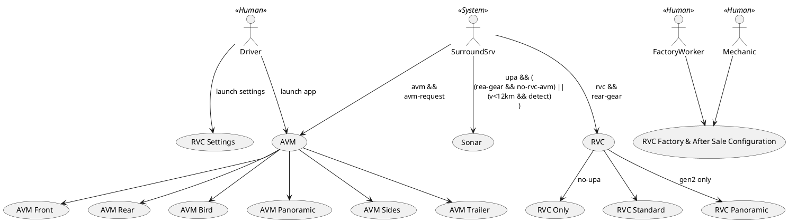

# Parking Use Cases

## System Use Cases Sources

All System Requirements are in this Doors folder :
`/2. Requirements and Validations/22. System level/S25. ADAS Parking/UPA FKP - Ultrasonic Park Assist and FlanK Protection`

Driver oriented use cases are available in following sub-folders :

- [REQ_SYS_Display](doors://rqm.intra.renault.fr:36677/?version=2&prodID=0&urn=urn:telelogic::1-5346c73776b3782d-M-00142845) in `ADAS Regulation/Display`
- [REQ_SYS_UPAFKP](doors://rqm.intra.renault.fr:36677/?version=2&prodID=0&urn=urn:telelogic::1-5346c73776b3782d-M-000d7aa4) in `UPA FKP - Ultrasonic Park Assist and FlanK Protection`
- [REQ_SYS_RVC](doors://rqm.intra.renault.fr:36677/?version=2&prodID=0&urn=urn:telelogic::1-5346c73776b3782d-M-000cbd04) in `RVC - Rear View Camera`
- [REQ_SYS_AVM](doors://rqm.intra.renault.fr:36677/?version=2&prodID=0&urn=urn:telelogic::1-5346c73776b3782d-M-00071c06) in `AVM - Around View Monitor`
- [REQ_SYS_RCTX](doors://rqm.intra.renault.fr:36677/?version=2&prodID=0&urn=urn:telelogic::1-5346c73776b3782d-M-000d3c04) in `RCTX - Rear Cross Traffic Alert and Braking`
- [REQ_SYS_G-R-AEB](doors://rqm.intra.renault.fr:36677/?version=2&prodID=0&urn=urn:telelogic::1-5346c73776b3782d-M-001cfb05) in `R-AEB – Global Rear AEB`
- [REQ_SYS_APA](doors://rqm.intra.renault.fr:36677/?version=2&prodID=0&urn=urn:telelogic::1-5346c73776b3782d-M-000b80c5) in `APA - Active Parking Aid`
  > APA : Automatic Park Assist (HFP, HFPB, APK, FAPK, IPA, FAP)
- `PSM - Parking Slot Measurement`
- [REQ_SYS_RPK](doors://rqm.intra.renault.fr:36677/?version=2&prodID=0&urn=urn:telelogic::1-5346c73776b3782d-M-00142584) : `RPK - Remote Parking`
- `DPK – Driverless Parking`
- `MVC - Multi View Camera`

## HHN Program

This program is the development vehicule for Swlabs Parking Apps.

### Product Increment 2 (PI2) Features

- UPA/FKP
- RVC (gen1 analog & digital)
- AVM (digital)

### Next Features

- HFP
- FAPK
- RCTA/RAEB

## Use Cases Overview

